# Знакомство с базами данных (семинары)

## Урок 1. Знакомство с базами данных
Составьте таблицы для хранения сведений об общественном транспорте.
— Можно на примере автобусов.
— При составлении таблиц не берите слишком много сущностей. Ориентируйтесь на структуру типа: «У нас есть автобусы на разных маршрутах, у автобуса есть водитель, также в автобусе работает кондуктор». Более сложные/глубокие структуры пока лучше не брать.

## Урок 2. Работа с данными из разных таблиц

```
Все решения выполнены в SQL запросах Access 
ДЗ2 Microsoft Access База данных.accdb
```

### Начальные условия:

Общая таблтца:

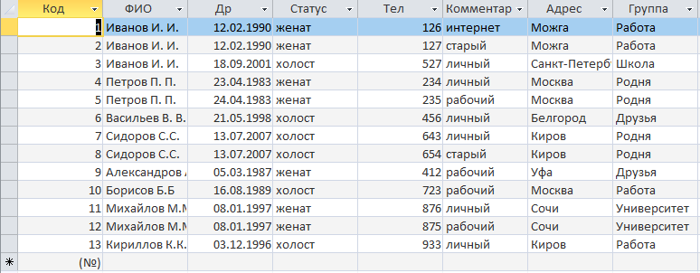

Люди:

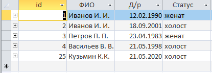

Адреса:

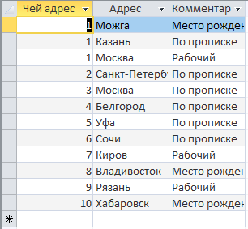

Телефон:


## Чему будет равна выборка:

1. SELECT ФИО, Д/р, Адрес FROM Общий список
```
SELECT [Общий список].ФИО, [Общий список].[Др], [Общий список].Адрес
FROM [Общий список];
```
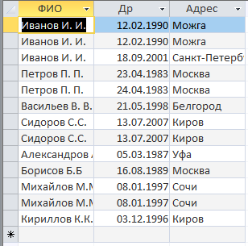

2. SELECT ФИО, Статус FROM Общий список WHERE Адрес = «Можга»
```
SELECT [Общий список].ФИО, [Общий список].Статус
FROM [Общий список]
WHERE ((([Общий список].Адрес)="Можга"));
```


3. SELECT ФИО FROM Общий список WHERE Адрес = «Москва» AND Группа = «Работа»
```
SELECT [Общий список].ФИО
FROM [Общий список]
WHERE ((([Общий список].Адрес)="Москва") AND (([Общий список].Группа)="Работа"));
```


4. SELECT Д/р FROM Общий список WHERE Адрес = «Москва» OR Группа = «Работа»
```
SELECT [Общий список].Др
FROM [Общий список]
WHERE (([Общий список].Адрес = "Москва") OR ( [Общий список].Группа = "Работа"));
```
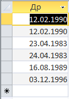

## Что будет результатом следующих JOIN’ов:

5. INNER JOIN Люди, Адреса ON id = Чей адрес
```
SELECT *
FROM Люди INNER JOIN Адреса ON Люди.id = Адреса.[Чей адрес];
```
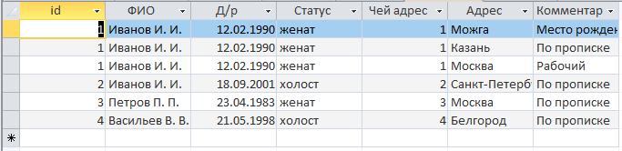

6. LEFT JOIN Люди, Адреса ON id = Чей адрес
```
SELECT *
FROM Люди LEFT JOIN Адреса ON Люди.id = Адреса.[Чей адрес];
```
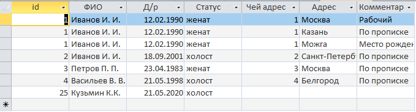
7. RIGHT JOIN Люди, Адреса ON id = Чей адрес
```
SELECT *
FROM Люди RIGHT JOIN Адреса ON Люди.id = Адреса.[Чей адрес];
```
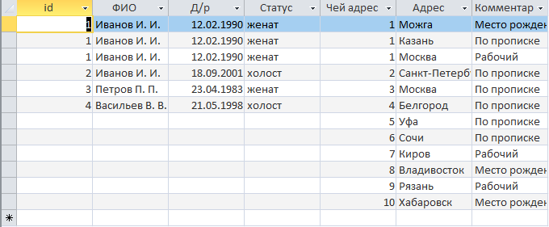
8. FULL JOIN Люди, Адреса ON id = Чей адрес

_FULL JOIN в Access реализуется составным оператором LEFT И RIGHT JOIN_
```
SELECT *
FROM Люди LEFT JOIN Адреса ON Люди.id = Адреса.[Чей адрес]
UNION SELECT *
FROM Люди RIGHT JOIN Адреса ON Люди.id = Адреса.[Чей адрес]
WHERE  Люди.id IS NULL;
```
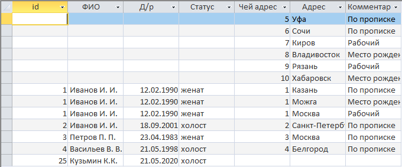

Дополнительное задание. Что будет результатом выборки:

9. SELECT ФИО, Адрес, Комментарий FROM Люди RIGHT JOIN Адреса ON id = Чей Адрес
```
SELECT [Люди].ФИО, [Адреса].Адрес, [Адреса].Комментарий
FROM Люди RIGHT JOIN Адреса ON Люди.id = Адреса.[Чей адрес];
```
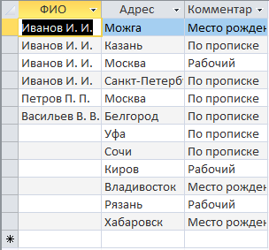
---

```
Все решения выполнены в SQL запросах Access: 
ДЗ2 Microsoft Access База данных.accdb

Исходные данные: ДЗ2 - Данные для семинара.xlsx
```
Для переключения запроса в режим SQL - нажать правой кнопкой на заголовок открытого запроса

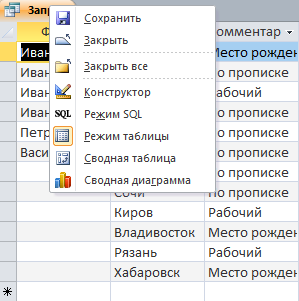
